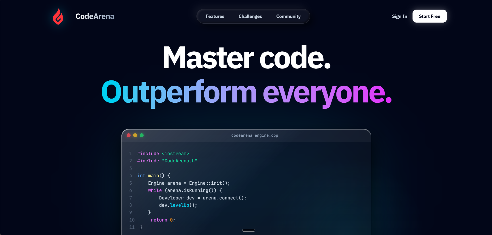
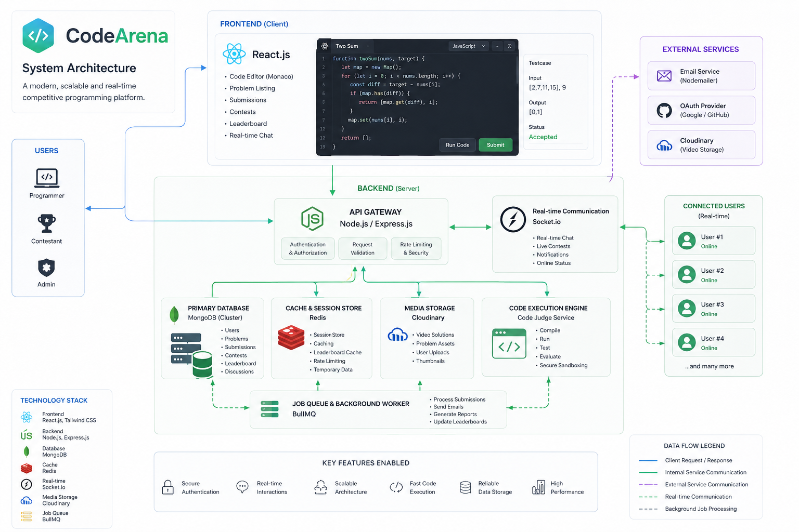

# 🏆 CodeArena


**CodeArena** is a modern, high-performance competitive programming platform built with the MERN stack. Designed with a premium "Glassmorphism" UI, it provides an immersive arena for developers to solve algorithmic challenges, compete in live contests, and track their performance.


---

## ✨ Features

- ⚔️ **Live Contest Arena**: Compete in real-time coding contests with a split-pane coding environment and live Socket.io integrated chat.
- 🧠 **Algorithmic Challenges**: A rich library of problems categorized by difficulty and tags, with robust server-side pagination and filtering.
- ⚡ **Code Execution Engine**: Secure code evaluation with multi-language support (C++, Java, Python, JavaScript).
- 📈 **Dynamic User Profiles**: Track your coding journey with a 30-day activity graph (powered by Recharts) and detailed submission history.
- 🏆 **Global Leaderboard**: See how you rank against other developers in the arena.
- 🛡️ **Admin Overlord Dashboard**: Secure admin panel to create problems, manage test cases, and upload solution videos via Cloudinary.
- 🎨 **Pro-Max UI/UX**: A stunning, responsive design featuring Glassmorphism, Claymorphism, and deep dark mode aesthetics.

---

## 📸 Sneak Peek

### Landing Page


### System Architecture


---

## 🛠️ Tech Stack

### Frontend
- **Framework**: React.js (Vite)
- **Styling**: Tailwind CSS, Framer Motion
- **Charts**: Recharts
- **State Management**: Redux Toolkit

### Backend
- **Runtime**: Node.js & Express.js
- **Database**: MongoDB (Mongoose)
- **Caching**: Redis (for JWT blacklisting)
- **Real-time**: Socket.io
- **Media**: Cloudinary (Video hosting)

---

## 🚀 Getting Started

### Prerequisites
- Node.js (v18+)
- MongoDB instance
- Redis Server
- Cloudinary Account (for video uploads)

### Installation

1. **Clone the repository:**
   ```bash
   git clone https://github.com/Athiran-dev/CodeArena.git
   cd CodeArena
   ```

2. **Install Backend Dependencies:**
   ```bash
   cd backend
   npm install
   ```

3. **Install Frontend Dependencies:**
   ```bash
   cd ../frontend
   npm install
   ```

4. **Environment Variables:**
   Create a `.env` file in the `backend` directory and add your keys:
   ```env
   PORT=3000
   MONGO_URI=your_mongodb_uri
   JWT_KEY=your_secret_key
   CLOUDINARY_CLOUD_NAME=your_name
   CLOUDINARY_API_KEY=your_key
   CLOUDINARY_API_SECRET=your_secret
   ```

5. **Run the App:**
   - **Backend**: `npm run dev` (from `/backend`)
   - **Frontend**: `npm run dev` (from `/frontend`)

---

## 🤝 Contributing
Contributions, issues, and feature requests are welcome! Feel free to check the [issues page](https://github.com/Athiran-dev/CodeArena/issues).

## 📝 License
This project is licensed under the MIT License.

---
*Built with ❤️ by [Athiran-dev](https://github.com/Athiran-dev)*
